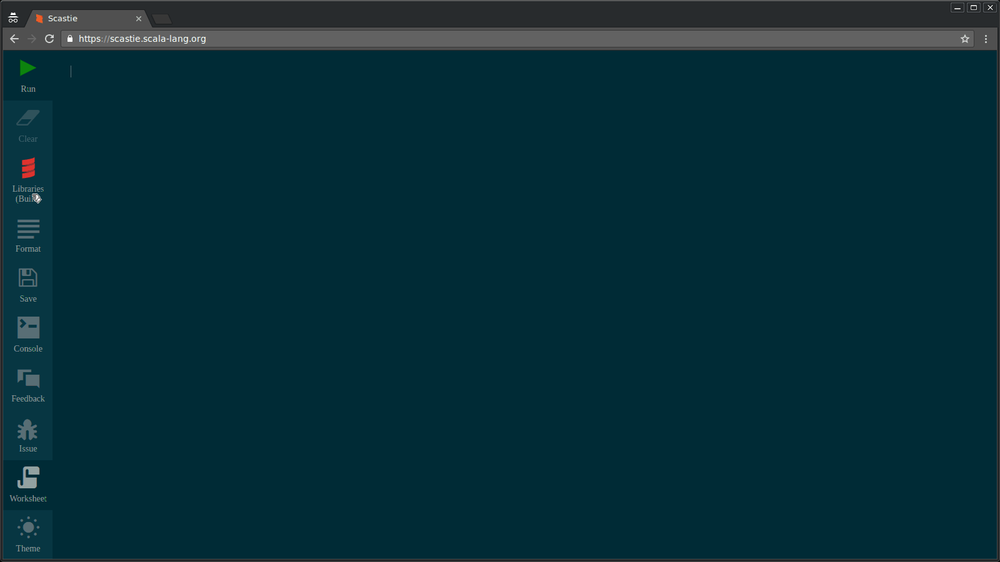

# Introducing Scastie - An interactive playground for Scala.

The Scala Center team is very proud to announce the Beta of Scastie.

Aleh Aleshka ([OlegYch](https://github.com/OlegYch/)) is the original author of this project. His objective was to create a collaborative debugging tool where you can share and reproduce bugs. Our idea was to extend this project with a modern user interface.

# What can I do with Scastie ?

Scastie can run any Scala program in your browser. You don't need to install any specific software.

We run your code in an isolated java virtual machine on our servers. We allow you to specify the scala version, add libraries and much more. By default we instrument your code to provide a REPL like environement. You can format your code with scala-fmt. We integrated a scaladex interface to allow you to search the Scala ecosystem. You dont need to remember the last version of a specific library anymore!

Let's see how it performs. Here we use scrimage, a simple image library. We download an image, apply a filter and serve both images back to the browser.

<iframe width="610" height="315" src="https://www.youtube.com/embed/ugFgdncsxEQ" frameborder="0" allowfullscreen></iframe>

# How does Scastie work?

When a user evaluates his code the browser sends all it's input to our server. Based on the configuration it will forward the evaluation to an sbt instance. The output will be streamed back to the user. A specific protocol will allow the client to interpret different events such as compiler errors, runtime exception, instrumentation, console output, etc. The worksheet mode instruments each top level expression. It wraps the code inside a class and associate a line position to a pair of value and type.

Using sbt help us supporting a large range of platforms (Scalac, Dotty, Scala.js, Scala-Native and Typeleve's Scala). It allows us to support newer Scala versions and resolves libraries dependencies.

# What's next ?

* Improve the sharing model. For example, we could use a similar approach as gist where you can fork and edit code snippets. 
* Support Scala.js and Scala-Native
* Embedded View and Libraries Example.
